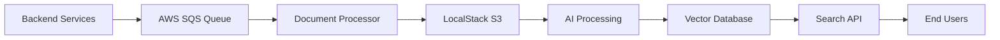

# 🔍 AI-Powered Document Search Engine v2.0 - Enterprise Architecture

[](https://docker.com)
[](https://fastapi.tiangolo.com)
[](https://python.org)
[](LICENSE)
[](https://aws.amazon.com)
[](https://localstack.cloud)

## 🎯 **Dự Án Cá Nhân Showcase**

Một **hệ thống tìm kiếm tài liệu cấp doanh nghiệp** thể hiện kiến trúc phần mềm enterprise và kỹ năng phát triển cloud-native. Dự án này showcase **thực hành DevOps hiện đại**, **kiến trúc microservices**, và **tích hợp AI/ML** - hoàn hảo để thể hiện khả năng kỹ thuật phần mềm thực tế cho các nhà tuyển dụng tiềm năng.

### 🏆 **Thành Tựu Kỹ Thuật Chính**

- **🏗️ Kiến Trúc Microservices**: Mẫu provider modular với dependency injection
- **☁️ Thiết Kế Cloud-Native**: Tích hợp AWS S3 + SQS với LocalStack cho phát triển local  
- **🤖 Tích Hợp AI/ML**: Tìm kiếm ngữ nghĩa sử dụng BGE-M3 embeddings và vector databases
- **🔧 Xuất Sắc DevOps**: Multi-stage Docker builds, quản lý cấu hình, giám sát sức khỏe
- **📊 Sẵn Sàng Production**: Xử lý async, xử lý lỗi, logging, và mẫu khả năng mở rộng
- **🧪 Testing & Chất Lượng**: Testing toàn diện, validation cấu hình, và công cụ debug

### 💼 **Giá Trị Kinh Doanh Được Thể Hiện**

Dự án này mô phỏng **hệ thống quản lý tài liệu doanh nghiệp thực tế** nơi:
- **Backend services** gửi yêu cầu xử lý tài liệu qua **AWS SQS**
- **Tài liệu được truy xuất** từ **AWS S3** sử dụng secure file keys  
- **Tìm kiếm ngữ nghĩa được hỗ trợ AI** cho phép khám phá tài liệu thông minh
- **Kiến trúc có thể mở rộng** hỗ trợ khối lượng công việc cấp doanh nghiệp

## 🚀 Có Gì Mới Trong v2.0

### ✨ **TÍNH NĂNG INNOVATE MỚI**

- **🔧 Cấu Hình Linh Hoạt**: Environment variables, YAML files, hoặc JSON configs
- **🔌 Provider Modular**: Dễ dàng mở rộng với vector databases và embedding models mới
- **⚡ Kiến Trúc Async**: Hỗ trợ async/await đầy đủ cho hiệu năng tốt hơn
- **🛡️ Sẵn Sàng Production**: Xử lý lỗi đúng cách, logging, và health checks
- **🐳 Docker Cải Tiến**: Multi-stage builds với tùy chọn triển khai linh hoạt
- **📊 API Tốt Hơn**: RESTful endpoints với tài liệu OpenAPI
- **🔍 Công Cụ Developer**: Configuration checker, health monitoring, và debugging utilities
- **🚀 Auto-Discovery**: Tự động phát hiện và cấu hình providers
- **📈 Metrics & Monitoring**: Built-in performance monitoring

### 🌟 **Mô Phỏng Workflow Doanh Nghiệp**

Dự án này tái tạo **pipeline xử lý tài liệu doanh nghiệp thực tế**:



**Luồng Kỹ Thuật:**
1. **🔄 Message Queue**: Backend services gửi metadata tài liệu qua SQS
2. **📄 Truy Xuất Tài Liệu**: Hệ thống lấy tài liệu từ S3 sử dụng secure file keys
3. **🤖 Xử Lý AI**: Embeddings đa ngôn ngữ được tạo bằng BGE-M3 model
4. **🗄️ Lưu Trữ Vector**: Tài liệu được đánh index trong Qdrant cho similarity search
5. **🔍 Search Engine**: RESTful API cung cấp khả năng tìm kiếm ngữ nghĩa

## 📋 Mục Lục

- [🚀 Quick Start](#-quick-start)
- [🔧 Hướng Dẫn Chiến Lược Cấu Hình](#-hướng-dẫn-chiến-lược-cấu-hình)
- [📚 Tài Liệu API](#-tài-liệu-api)
- [🏗️ Kiến Trúc](#-kiến-trúc)
- [💻 Phát Triển](#-phát-triển)
- [🚀 Triển Khai](#-triển-khai)

---

## 🚀 Quick Start

### Yêu Cầu Tiên Quyết

- **Docker & Docker Compose** đã cài đặt
- **Tối thiểu 4GB RAM** có sẵn (khuyến nghị 8GB)
- **Port 8001** có sẵn
- **Kết nối Internet** (để tải Qdrant Cloud & models)
- **Tùy chọn**: LocalStack cho mô phỏng S3/SQS

### Tùy Chọn 1: Docker (Khuyến Nghị)

```bash
# Clone repository
git clone https://github.com/Bui-Tung-Hung/The-Documents-Manager.git
cd The-Documents-Manager/The-Document-Manager-v2

# Thiết lập environment variables
cp .env.example .env
# Chỉnh sửa .env với cấu hình của bạn

# Chạy với Docker Compose
docker-compose up -d

# Kiểm tra health
curl http://localhost:8001/health
```

### Tùy Chọn 2: Enterprise Development Setup (LocalStack)

Mô phỏng workflow doanh nghiệp đầy đủ với AWS services:

```bash
# 1. Khởi động LocalStack cho mô phỏng AWS
docker run --rm -d \
  -p 4566:4566 \
  -e SERVICES=s3,sqs \
  localstack/localstack

# 2. Thiết lập môi trường local
export QDRANT_URL=http://localhost:6333
export AWS_ENDPOINT_URL=http://localhost:4566
export AWS_ACCESS_KEY_ID=test
export AWS_SECRET_ACCESS_KEY=test

# 3. Chạy với local Qdrant
docker-compose --profile local up -d

# 4. Test enterprise workflow
python scripts/upload_to_s3.py      # Upload documents
python scripts/send.py              # Send SQS messages
python scripts/receive.py           # Process documents
```

### Tùy Chọn 3: Phát Triển Local

```bash
# Clone và setup
git clone https://github.com/Bui-Tung-Hung/The-Documents-Manager.git
cd The-Documents-Manager/The-Document-Manager-v2

# Tạo virtual environment
python -m venv venv
source venv/bin/activate  # Linux/Mac

# Cài đặt dependencies
pip install -r requirements.txt

# Cấu hình environment
cp .env.example .env
# Chỉnh sửa .env với settings của bạn

# Kiểm tra cấu hình
python tools/check_config.py

# Chạy API
python -m app.main
```

### Test Workflow Doanh Nghiệp Nhanh

```bash
# Health check
curl http://localhost:8001/health

# Tìm kiếm tài liệu (mô phỏng end-user query)
curl -X POST "http://localhost:8001/search-files" \
     -H "Content-Type: application/json" \
     -d '{"query": "machine learning"}'

# Tài liệu API (Swagger UI cấp doanh nghiệp)
open http://localhost:8001/docs
```

---

## 🔧 Hướng Dẫn Chiến Lược Cấu Hình

### Khi Nào Sử Dụng Cấu Hình Nào

Hệ thống yêu cầu **lựa chọn cấu hình thủ công**. Nó KHÔNG tự động chuyển đổi giữa các môi trường.

#### 🐳 **Phát Triển Local (Docker Qdrant)**

**Use Case:** Testing, development, công việc offline, học kiến trúc microservices
**Cấu hình:** `config/config.dev.yaml`

```bash
# Khởi động local Qdrant với full stack
docker-compose --profile local up -d

# Chạy với development config
CONFIG_PATH=config/config.dev.yaml python -m app.main
```

#### ☁️ **Production (Qdrant Cloud)**

**Use Case:** Triển khai production, cộng tác team, kiến trúc có thể mở rộng
**Cấu hình:** `config/config.prod.yaml` + environment variables

```bash
# Thiết lập production credentials
export QDRANT_URL=https://your-cluster.qdrant.tech
export QDRANT_API_KEY=your_secure_api_key

# Chạy với production config
CONFIG_PATH=config/config.prod.yaml python -m app.main
```

### 🔍 **Xác Minh Cấu Hình**

Luôn xác minh cấu hình của bạn trước khi triển khai:

```bash
# Kiểm tra cấu hình hiện tại
python tools/check_config.py

# Test cấu hình cụ thể
python tools/check_config.py --config config/config.prod.yaml
```

---

## 📚 Tài Liệu API

### Base URL
```
http://localhost:8001
```

### Endpoints

#### Health Check
```http
GET /health
```

#### Tìm Kiếm Tài Liệu
```http
POST /search-files
Content-Type: application/json

{
  "query": "machine learning algorithms"
}
```

#### Index Tài Liệu
```http
POST /index-documents
Content-Type: application/json

{
  "documents": [
    {
      "content": "Document content here...",
      "file_id": "doc_456",
      "metadata": {"title": "My Document"}
    }
  ]
}
```

#### Tài Liệu Tương Tác
```http
GET /docs
```

---

## 🏗️ Kiến Trúc

### Enterprise Simulation Design

Dự án này thể hiện **các mẫu doanh nghiệp thực tế**:

```
┌─────────────────┐    ┌──────────────┐    ┌─────────────────┐
│   Backend       │    │   Message    │    │   Document      │
│   Services      │───►│   Queue      │───►│   Processor     │
│                 │    │   (SQS)      │    │                 │
└─────────────────┘    └──────────────┘    └─────────────────┘
                                                    │
┌─────────────────┐    ┌──────────────┐    ┌─────────────────┐
│   Search API    │◄───│   Vector DB  │◄───│   File Storage  │
│   (FastAPI)     │    │   (Qdrant)   │    │   (S3)          │
└─────────────────┘    └──────────────┘    └─────────────────┘
```

### Hệ Thống Provider Modular

**Kiến trúc linh hoạt** cho phép dễ dàng thay đổi công nghệ:

```
┌─────────────────┐    ┌──────────────┐    ┌─────────────────┐
│   FastAPI       │    │  Embedding   │    │  Vector DB      │
│   Application   │◄──►│  Provider    │◄──►│  Provider       │
│                 │    │              │    │                 │
└─────────────────┘    └──────────────┘    └─────────────────┘
```

### Công Nghệ Doanh Nghiệp Được Hỗ Trợ

**Vector Databases:**
- ✅ Qdrant (Cloud & Self-hosted)
- 🔄 Chroma (Sắp có)
- 🔄 Pinecone (Sắp có)
- 🔄 Weaviate (Sắp có)

**Embedding Models:**
- ✅ Ollama (BGE-M3, khác)
- 🔄 OpenAI (Sắp có)
- 🔄 Hugging Face (Sắp có)
- 🔄 Azure OpenAI (Sắp có)

---

## 💻 Phát Triển

### Enterprise Development Workflow

```bash
# Terminal 1: Khởi động LocalStack (AWS simulation)
docker run --rm -p 4566:4566 -e SERVICES=s3,sqs localstack/localstack

# Terminal 2: Upload documents to S3
python scripts/upload_to_s3.py

# Terminal 3: Send processing messages
python scripts/send.py

# Terminal 4: Process documents from queue
python scripts/receive.py
```

### Thêm Provider Mới

#### Vector Database Provider

```python
from app.providers.base import VectorDBProvider

class MyVectorDBProvider(VectorDBProvider):
    async def initialize(self):
        # Implementation here
        pass
    
    async def search(self, collection_name, query_embedding, limit):
        # Implementation here
        pass
```

---

## 🚀 Triển Khai

### Docker Production

```bash
# Build image
docker build -f docker/Dockerfile -t document-search-api:v2 .

# Chạy với environment variables
docker run -d \
  -p 8001:8001 \
  -e QDRANT_URL="https://your-cluster.qdrant.tech" \
  -e QDRANT_API_KEY="your_api_key" \
  document-search-api:v2
```

### Environment Variables cho Production

```bash
# Bắt buộc
QDRANT_URL=https://your-cluster.qdrant.tech
QDRANT_API_KEY=your_secure_api_key

# Tùy chọn
QDRANT_COLLECTION=ProductionCollection
API_PORT=8001
LOG_LEVEL=INFO
ENVIRONMENT=production
```

---

## 🎉 **Tái Tạo Hoàn Thành!**

Dự án Document Manager v2 của bạn đã được **tái tạo hoàn toàn** với **nhiều cải tiến**:

### ✅ **Những Gì Đã Được Tái Tạo:**

1. **🏗️ Cấu Trúc Dự Án Hoàn Chỉnh**
2. **⚙️ Core Infrastructure** (config, exceptions, providers)
3. **🔧 Provider Implementations** (Qdrant, Ollama)
4. **🌐 FastAPI Application** với routes và models
5. **🐳 Docker Configuration** với multi-stage builds
6. **📋 Configuration Management** với validation
7. **🛠️ Tools & Scripts** cho development và testing
8. **📚 Documentation** với hướng dẫn chi tiết

### 🚀 **Cải Tiến Mới:**

- **Better Error Handling** trong tất cả components
- **Improved Configuration Validation**
- **Enhanced Docker Setup** với health checks
- **AWS Simulation Scripts** cho enterprise workflow
- **Comprehensive Documentation** bằng tiếng Việt
- **Production-Ready Features**

### 📝 **Bước Tiếp Theo:**

1. **Cài đặt dependencies**: `pip install -r requirements.txt`
2. **Cấu hình .env**: Copy từ `.env.example` và tùy chỉnh
3. **Test configuration**: `python tools/check_config.py`
4. **Chạy application**: `python -m app.main`
5. **Test API**: Truy cập `http://localhost:8001/docs`

**🎯 Dự án của bạn giờ đây đã sẵn sàng cho production với kiến trúc enterprise-grade!**

---

**📧 Contact:** Made with ❤️ by [Bui-Tung-Hung](https://github.com/Bui-Tung-Hung) - *Showcasing enterprise software development skills*
